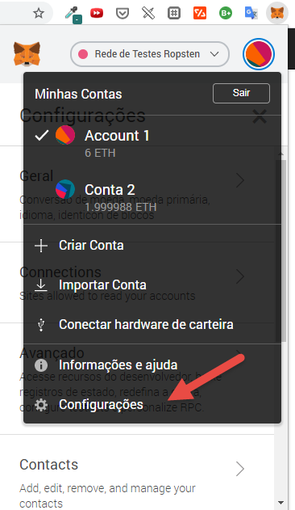
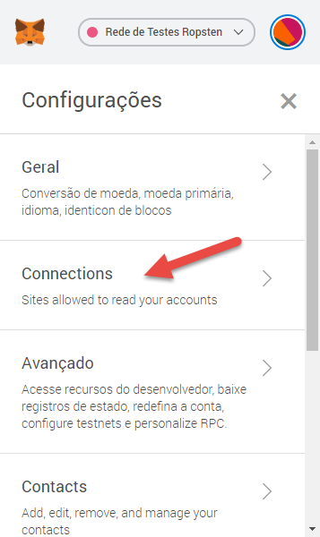
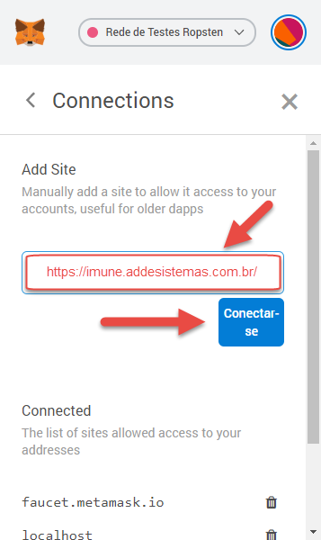
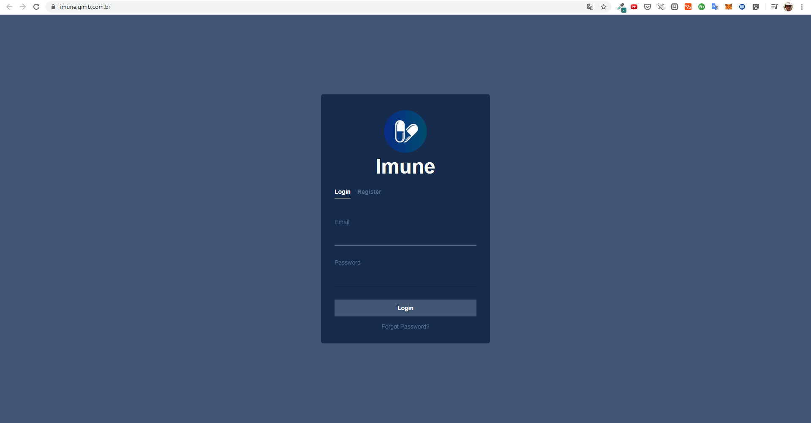
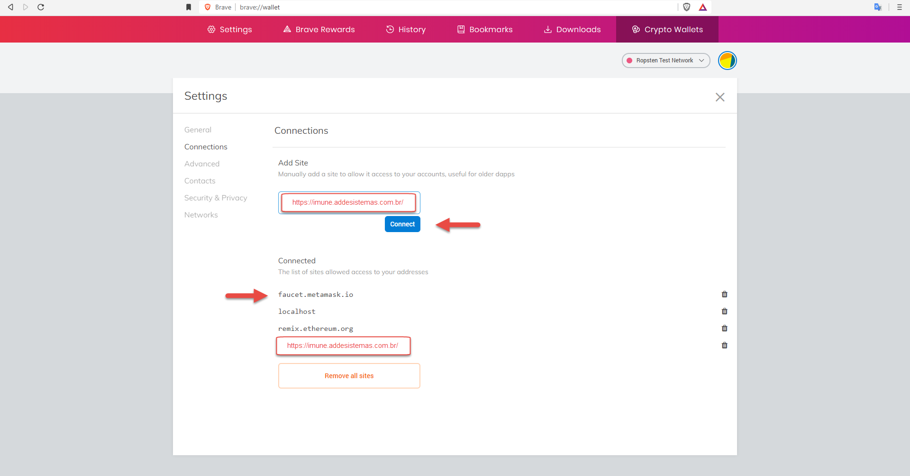
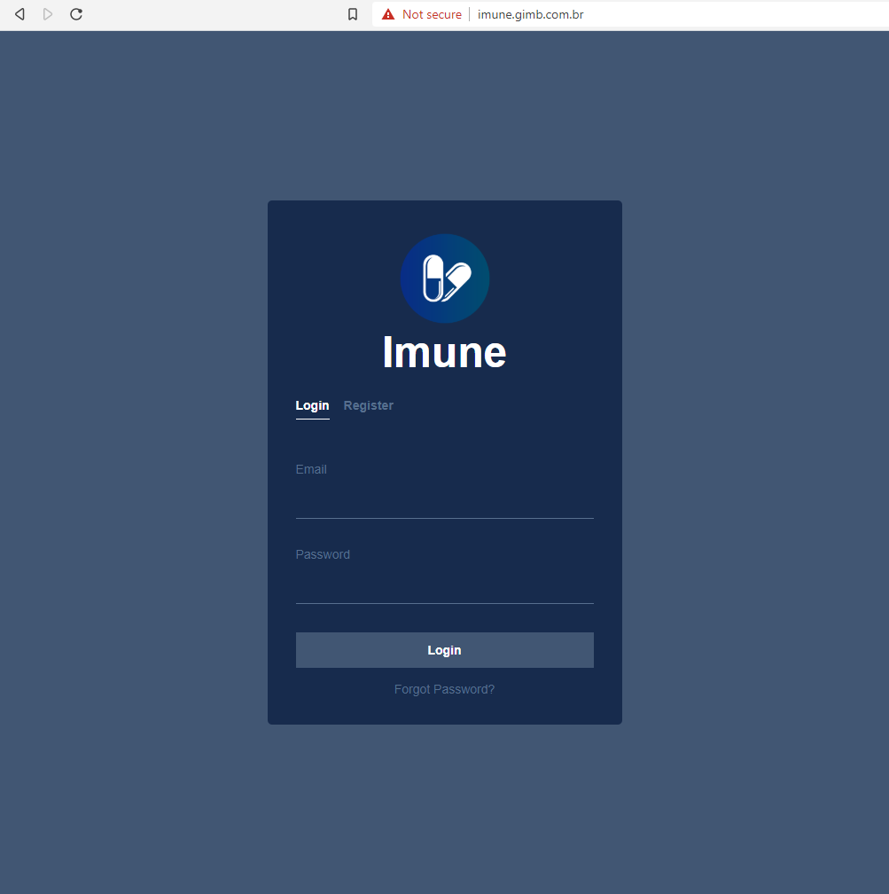

# megahack-criptovaley-time18-frontend

- **Desafio:** Crypto Valley
- **Time:** 18
- **Membros:**

    - Anderson Rocha - andersonrocha@outlook.com
    - David Borelli - david_borelli@live.com
    - David Pagliotto - dpagliotto@gmail.com
    - Felipe Guido – felipeguido1@gmail.com
    - Ricardo Bull - rcbull@gmail.com

## Para executar o Projeto

Após o download do mesmo, no diretório executar o seguinte comando no terminal para instalar
todas as dependências que o projeto precisa para ser executado.

Caso utilize o npm executar:

#### `npm install`

Caso utilize o yarn executar:

#### `yarn`

Após todos as dependências serem baixadas corretamente, para deixar o projeto "no ar",
executar o seguinte comando:

NPM:

#### `npm start`

yarn:

#### `yarn start`

Se tudo ocorreu correntamente no console irá ser apresentado o endereço em que
o projeto está sendo executado. ;) 🚀

# URL do sistema (MVP)

[https://imune.addesistemas.com.br/](https://imune.addesistemas.com.br/)

Usuário: imune@addesistemas.com.br 

Senha: 123@iMUNE

## No browser Chrome:

1. Instalar o plugin metamask

[url do plugin](https://metamask.io/)

2. Liberar o domínio no metamask, em connections, clicando em adicionar

2.1 Abrir Settings

2.2 Abrir Connections

2.1 Adicionar conexão

3. Acessar a aplicação e cadastrar lote e vacinação

## No browser Brave:

**O Brave permite gerenciar as wallets de forma mais organizada e sem o plugin, basta acessar:

[brave://wallet](brave://wallet)

1. Liberar o domínio para acessar a wallet

2. Acessar a aplicação e cadastrar lote e vacinação

